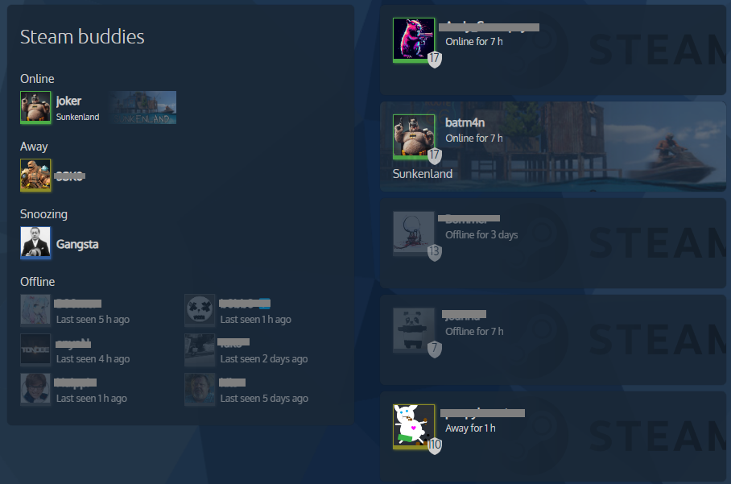

# Steam card compact

Home Assistant dashboard card that shows what your Steam friends are playing.

[![GitHub Release][releases-shield]][releases]
[![License][license-shield]](LICENSE)
[![GitHub Activity][commits-shield]][commits]

## Support

Hey dude! Help me out for a couple of :beers: or a :coffee:!

[](https://www.buymeacoffee.com/jesmak)

## What is it?

A custom card that shows Steam players: who is online, what they are playing, and how long ago the others were last
seen. The list card puts two players per row to save vertical space, grouped by whether they are online, away,
snoozing or offline. Given a single player, it draws a bigger card with their avatar, level and game instead.

It is a more compact take on [kb-steam-card](https://github.com/Kibibit/kb-steam-card) by Kibibit, which hadn't been
updated in a few years. It fits a two column horizontal stack, and still looks right at full width.



The players come from Home Assistant's own [Steam
integration](https://www.home-assistant.io/integrations/steam_online/), which creates a `sensor.steam_*` entity per
player.

## Options

| Name              | Type           | Requirement  | Description                                                     | Default         |
| ----------------- | -------------- | ------------ | --------------------------------------------------------------- | --------------- |
| `type`            | string         | **Required** | `custom:steam-card-compact`                                     |                 |
| `entity`          | string or list | **Required** | The player, or players, to show. One player draws the big card. |                 |
| `auto_populate`   | boolean        | Optional     | List every `sensor.steam_*` entity instead of naming them       | `false`         |
| `title`           | string         | Optional     | Shown at the top of the list card                               | `Steam Friends` |
| `game_background` | boolean        | Optional     | Draw the game's header picture behind the player                | `true`          |
| `name_overrides`  | list           | Optional     | Names to show instead of the entities' own, below               |                 |

Either `entity` or `auto_populate` is needed.

| Name     | Type   | Requirement  | Description                     |
| -------- | ------ | ------------ | ------------------------------- |
| `entity` | string | **Required** | The player whose name to change |
| `name`   | string | **Required** | The name to show for them       |

```yaml
type: custom:steam-card-compact
title: Steam buddies
entity:
  - sensor.steam_abc
  - sensor.steam_def
name_overrides:
  - entity: sensor.steam_abc
    name: ABC-MAN
```

```yaml
type: custom:steam-card-compact
auto_populate: true
```

```yaml
type: custom:steam-card-compact
entity: sensor.steam_abc
```

## How to install

### With HACS

1. Add this repository to HACS custom repositories with type **Dashboard**
2. Search for Steam card compact in HACS and download it
3. Refresh your browser

### Manually

1. Download `steam-card-compact.js` from the latest release and copy it to the `config/www` folder of your Home
   Assistant installation
2. In Home Assistant settings, open dashboards, click the three dots at the top right and open resources
3. Add a new resource with the path `/local/steam-card-compact.js` and type JavaScript
4. Refresh your browser

## Upgrading from 1.x

Nothing needs to be done: the card keeps its configuration. A player whose entity is missing is now named on the card
instead of breaking it, and a player seen less than a minute ago is written properly in seconds.

## Development

Requires Node 22.13 or newer.

```
npm install
npm run check
```

`npm run check` typechecks, lints, checks formatting, runs the tests and builds `dist/steam-card-compact.js`, which is
the file HACS installs and is committed to the repository.

| Path                        | What it contains                                    |
| --------------------------- | --------------------------------------------------- |
| `src/steam-card-compact.ts` | The card itself                                     |
| `src/friends.ts`            | Naming, ordering and grouping the players           |
| `src/logo.ts`               | The Steam logo drawn behind a player without a game |
| `src/localize.ts`           | The card's texts                                    |
| `tests/`                    | Tests, run with vitest                              |

## Thanks to

- [@Kibibit](https://github.com/Kibibit) for [kb-steam-card](https://github.com/Kibibit/kb-steam-card), which this
  card started from.

[commits-shield]: https://img.shields.io/github/commit-activity/y/jesmak/steam-card-compact.svg?style=for-the-badge
[commits]: https://github.com/jesmak/steam-card-compact/commits/main
[license-shield]: https://img.shields.io/github/license/jesmak/steam-card-compact.svg?style=for-the-badge
[releases-shield]: https://img.shields.io/github/release/jesmak/steam-card-compact.svg?style=for-the-badge
[releases]: https://github.com/jesmak/steam-card-compact/releases
