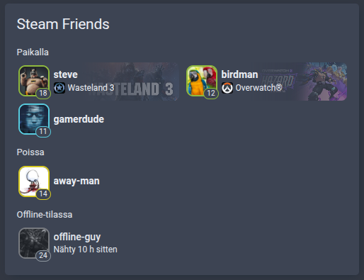
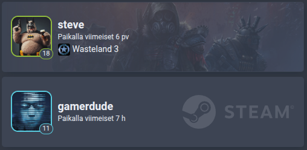

# Steam card compact

Home Assistant dashboard card that shows what your Steam friends are playing.

[![GitHub Release][releases-shield]][releases] [![GitHub Release Date][release-date-shield]][releases]

[![HACS][hacs-shield]][hacs] [![Home Assistant][home-assistant-shield]][home-assistant] [![License][license-shield]](LICENSE)

![Project Maintenance][maintenance-shield] [![GitHub Activity][commits-shield]][commits] [![Open bugs][bugs-shield]][bugs] [![Open enhancements][enhancements-shield]][enhancements]

## Support

Hey dude! Help me out for a couple of :beers: or a :coffee:!

[](https://www.buymeacoffee.com/jesmak)

## What is it?

A custom card that shows Steam players: who is online, what they are playing, and how long ago the others were last
seen. The list puts two players per row to save vertical space, grouped by what they are doing, and each player can
also be given a card of their own with their game behind them.

It is a more compact take on [kb-steam-card](https://github.com/Kibibit/kb-steam-card) by Kibibit, which hadn't been
updated in a few years. It fits a two column horizontal stack, and still looks right at full width.





The players come from Home Assistant's own [Steam
integration](https://www.home-assistant.io/integrations/steam_online/), which creates a sensor per player.

## Options

The card has a visual editor: add it from the card picker and choose the players. The options can also be written by
hand.

| Name              | Type           | Requirement  | Description                                             | Default         |
| ----------------- | -------------- | ------------ | ------------------------------------------------------- | --------------- |
| `type`            | string         | **Required** | `custom:steam-card-compact`                             |                 |
| `entity`          | string or list | **Required** | The player, or players, to show                         |                 |
| `auto_populate`   | boolean        | Optional     | Show every Steam player there is instead of naming them | `false`         |
| `layout`          | string         | Optional     | `auto`, `list`, or `player` for one player's own card   | `auto`          |
| `title`           | string         | Optional     | Shown at the top of the list                            | `Steam Friends` |
| `game_background` | boolean        | Optional     | Draw the game's picture behind the player               | `true`          |
| `name_overrides`  | list           | Optional     | Names to show instead of the entities' own, below       |                 |

Either `entity` or `auto_populate` is needed. With `auto` the card draws one player's own card when a single player is
named, and the list otherwise.

| Name     | Type   | Requirement  | Description                     |
| -------- | ------ | ------------ | ------------------------------- |
| `entity` | string | **Required** | The player whose name to change |
| `name`   | string | **Required** | The name to show for them       |

```yaml
type: custom:steam-card-compact
title: Steam buddies
entity:
  - sensor.steam_abc
  - sensor.steam_def
name_overrides:
  - entity: sensor.steam_abc
    name: ABC-MAN
```

```yaml
type: custom:steam-card-compact
auto_populate: true
```

```yaml
type: custom:steam-card-compact
layout: player
entity: sensor.steam_abc
```

## What it shows

Each player has their avatar, ringed in the colour of what they are doing: green in a game, blue online, red busy,
yellow away, purple looking to play or trade, grey offline. Their Steam level sits in the corner of the avatar, and
offline players are greyed out with the time they were last seen.

A player in a game has its icon and name, and the game's picture behind them. Clicking the game opens it in the Steam
store; clicking the player opens Home Assistant's own dialog for the sensor.

## How to install

### With HACS

1. Add this repository to HACS custom repositories with type **Dashboard**
2. Search for Steam card compact in HACS and download it
3. Refresh your browser

### Manually

1. Take `dist/steam-card-compact.js` from the source code of the [latest release][releases] and copy it to the
   `config/www` folder of your Home Assistant installation
2. In Home Assistant settings, open dashboards, click the three dots at the top right and open resources
3. Add a new resource with the path `/local/steam-card-compact.js` and type JavaScript
4. Refresh your browser

## Upgrading from 1.x

Nothing needs to be done: the card keeps its configuration, and one named player still gets a card of their own.

The card now has a visual editor, the layout can be chosen instead of following the number of players, and every state
Steam reports has a group of its own.

## Development

Requires Node 22.13 or newer.

```
npm install
npm run check
```

`npm run check` typechecks, lints, checks formatting, runs the tests and builds `dist/steam-card-compact.js`, which is
the file HACS installs and is committed to the repository.

| Path                        | What it contains                                    |
| --------------------------- | --------------------------------------------------- |
| `src/steam-card-compact.ts` | The card itself                                     |
| `src/editor.ts`             | The visual editor                                   |
| `src/friends.ts`            | Finding, naming, ordering and grouping the players  |
| `src/logo.ts`               | The Steam logo drawn behind a player without a game |
| `src/localize.ts`           | The card's texts                                    |
| `tests/`                    | Tests, run with vitest                              |

## Thanks to

- [@Kibibit](https://github.com/Kibibit) for [kb-steam-card](https://github.com/Kibibit/kb-steam-card), which this
  card started from.

[releases-shield]: https://img.shields.io/github/release/jesmak/steam-card-compact.svg?style=for-the-badge
[release-date-shield]: https://img.shields.io/github/release-date/jesmak/steam-card-compact?style=for-the-badge
[releases]: https://github.com/jesmak/steam-card-compact/releases
[hacs-shield]: https://img.shields.io/badge/HACS-Custom-orange.svg?style=for-the-badge
[hacs]: https://hacs.xyz/docs/faq/custom_repositories/
[home-assistant-shield]: https://img.shields.io/badge/Home%20Assistant-visual%20editor%20%2F%20yaml-green.svg?style=for-the-badge
[home-assistant]: https://www.home-assistant.io/
[license-shield]: https://img.shields.io/github/license/jesmak/steam-card-compact.svg?style=for-the-badge
[maintenance-shield]: https://img.shields.io/maintenance/yes/2026.svg?style=for-the-badge
[commits-shield]: https://img.shields.io/github/commit-activity/y/jesmak/steam-card-compact.svg?style=for-the-badge
[commits]: https://github.com/jesmak/steam-card-compact/commits/main
[bugs-shield]: https://img.shields.io/github/issues/jesmak/steam-card-compact/bug?style=for-the-badge&label=bugs&color=red
[bugs]: https://github.com/jesmak/steam-card-compact/labels/bug
[enhancements-shield]: https://img.shields.io/github/issues/jesmak/steam-card-compact/enhancement?style=for-the-badge&label=enhancements&color=blue
[enhancements]: https://github.com/jesmak/steam-card-compact/labels/enhancement
